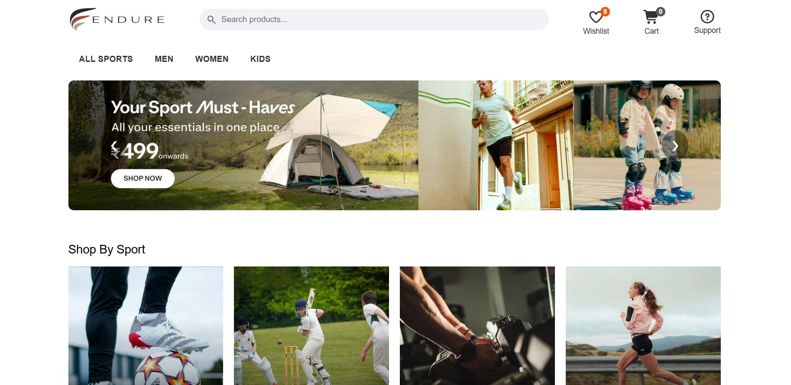

<h1 align="center">ENDURE SPORTS</h1>

<p align="center">This is a sports e-commerce static site made with html, css & javascript.
</p>

---


<p align="center">
  
  
  
  
  
  
</p>

> [!IMPORTANT]
> **AI Usage:** ChatGPT was used only for occasional conceptual guidance and CSS references but not directly copy pasted. The content is by me. I took help from my friend who is good at coding. He gave me some guidance while sitting in a google meet with me.
>
>While I was making this app I wasn't able to figure out that how I am supposed to write the javascript logic beacuse I am completely new at javascript. Sadly after making the hmtl and css entirely by myself, I realized that I will not be able to complete this project with my current javascript knowledge so I used Kimi AI and Chat GPT to write almost the entire javascript logic.
>
>I made sure that this project is not AI slop by giving all of my efforts to to describe the logic of javascript to the AI as I wanted in my site. I know that using AI makes the website downgraded but I tested all of the features and gave concrete review to the AI and logic. I tried my best to understand the javascript code and upto my knowledge I think I understand 60% of the javascript logic. For the javascript to work, I had to change 10% of my html and css as provided by the AI.
>
>I promise I will make my next Javascript project entirely by myself.

>
> ## Things I learned
>
> This is my second webpage. The cool part is that this time I practiced html and css without referring the docs. I learnt half of the things for the first time but these are some of the most impressive things I learnt :
> - how to take text input through html and modify it in  css
> - how to modify a button with css
> - how to use google material icons
> - how to use ":active" function in css
> - added dynamic absolute positionig
> - how to make a sliding section by hiding the overflow


## Screenshot


## Pages

### Home

The landing page containing:

- overview
- catalogue
- categories

### Product Page

- It consists of the details of product with MRP & rating and option to Add to cart & Buy Now.

### Wishlist

- It displays the items you have wish-listed.

### Cart

- It displays the items you have added to cart and has an option to check-out.

## Tech Stack
- HTML
- CSS
- Javascript
- Vercel
- Google Material Icons

I made this using only custom css. No tailwind/frameworks and components.

## Running Locally

1) Clone the repository:

```sh
 git clonehttps://github.com/pranjal-irl/ecommerce-app.git
```

2) Open index.html in your browser.

---

Made with love, bad decisions, and way too much free time.

© [The MIT LIcense](LICENSE)
